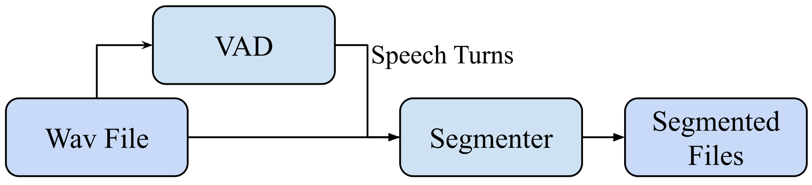

# VAD + Segmentation

---

[TOC]

## Overview

---

The trained model for VAD was done using [Pytorch](https://pytorch.org/) and is stored in `model.pth` and its code is in `model.py`.  Feature extraction is done using [python_speech_features](https://github.com/jameslyons/python_speech_features). Installation process of these two packages is explained below.  

In case of any questions please send an email to [sina.alisamir@gmail.com](mailto:sina.alisamir@gmail.com)

### Implementation

---



The file `VAD_Module.py` contains the class related to VAD module and `Segmenter.py` the class that does the segmenting. The VAD first returns the speech turns in a list. Then the Segmenter module would segment files based on the speech turns. Please see "run.py" for more detailed implementation. This goes without saying that the VAD module can be replaced by any other VAD that returns a similar formatted list. For changing model or parameters, feel free to change the code from the files!

### Installation

---

It was done with conda so anaconda must be installed on the targeted machine and after that to install the conda environment please run:

```bash
conda env create -f environment.yml
```

This will create an environment called "SinaVAD2" and can be activated either by running:

```bash
conda activate SinaVAD2
```

or:

```bash
source activate [anaconda_installation_path]/envs/SinaVAD2
```

#### In case of failure of the instructions above

---

Create a new environment on conda and after activating it, run the following commands to get the necessary packages installed:

```bash
conda install pytorch==1.6.0 cpuonly -c pytorch
conda install -c conda-forge pydub
pip install python_speech_features 
conda install -c anaconda scipy
conda install -c conda-forge pysoundfile
```

#### Testing Installation

---

In order to test if the installation was successfull run the following code after activating the conda environment installed and putting the  and run:

```bash
python run.py -i "./WavFiles" -o "./segments"
```

Where input wav files are put under `WavFiles` folder and the output segmented wav files will be put under the folder `segments`. 

```
NOTE: all audio files must be in PCM 16kHz 16bits signed-intege wav format and 16000Hz!
Preprocessing: sox "in.wav" -r 16000 -c 1 -b 16 -e signed-integer "out.wav"
```
